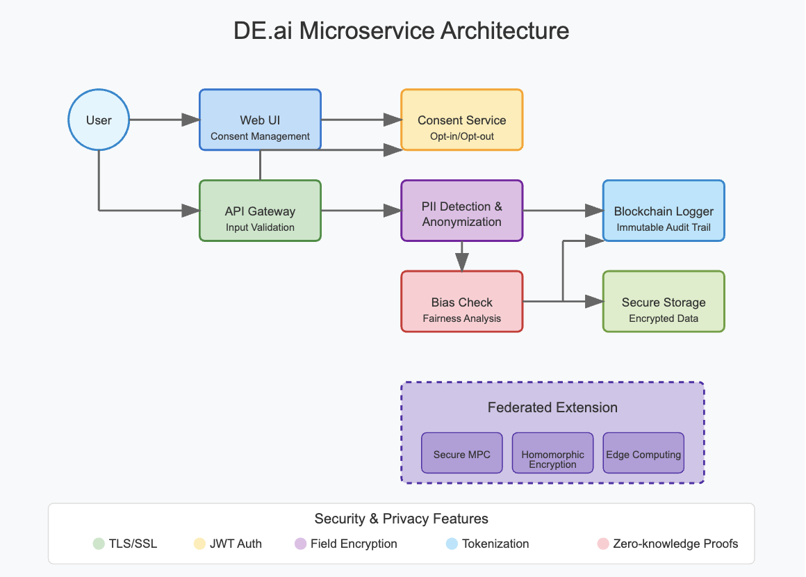

# DE.ai Microservice Solution for Privacy-Preserving Data Processing

## Part 1: High-Level Architecture Sketch

### Data Flow Architecture

The DE.ai microservice follows a privacy-by-design approach with the following data flow:

1. **User Data Submission**: User-generated textual data enters the system through secured API endpoints.
2. **Consent Validation**: The system checks if the user has opted in for data processing.
3. **PII Detection & Anonymization**: A lightweight LLM identifies personally identifiable information (PII) and anonymizes it.
4. **Bias Detection**: The system checks for potential biases in the text classification outcome.
5. **Blockchain Logging**: Each transformation event is logged to an immutable blockchain ledger.
6. **Secure Storage**: Anonymized data is stored securely for further processing.



### Security & Privacy Measures

- **Data in Transit**: All communications use TLS/SSL encryption.
- **Data at Rest**: Field-level encryption for sensitive data in storage.
- **Tokenization**: PII is replaced with non-sensitive tokens that maintain data utility.
- **Minimal Data Collection**: Only necessary information is processed and stored.
- **Zero-Knowledge Proofs**: Used for verification without exposing raw data.

### Consent & Ownership Framework

- **Pre-Processing Consent Check**: Data processing is blocked if consent is not granted.
- **JWT-Based Authentication**: User authentication includes consent claims.
- **Granular Consent Options**: Users can opt in/out for specific data processing purposes.
- **Consent Revocation**: System supports real-time consent withdrawal with data purging.

### Blockchain Audit Logging

- **Immutable Records**: All data transformations are logged to a blockchain.
- **Privacy-Preserving**: Only hashes of data and transformations are stored, not raw data.
- **Transparent Audit Trail**: Each transformation is linked to:
  - Transaction ID
  - Timestamp
  - Transformation type
  - Types of PII detected and anonymized
  - User consent reference

### Bias Check Integration

- **Post-Anonymization**: Bias detection occurs after PII anonymization but before storage.
- **Fairness Metrics**: System calculates demographic parity and equalized odds.
- **Mitigation Strategies**: Implements reweighting and post-processing adjustments.
- **Continuous Monitoring**: Tracks bias metrics over time to identify trends.

### Federated Extension

- **Secure MPC**: Allows computations across nodes without exposing raw data.
- **Homomorphic Encryption**: Enables computation on encrypted data.
- **Edge Computing**: Processes sensitive data locally before sharing results.
- **Consensus Mechanism**: Ensures consistent audit trails across federated nodes.

## Part 2: Node.js / Back-End Implementation

### API Endpoint for Data Ingestion

The core of the backend is a Node.js/Express endpoint that handles data ingestion with privacy and consent checks:

```javascript
router.post('/ingest', async (req, res) => {
  try {
    const { userId, textData } = req.body;
    
    if (!userId || !textData) {
      return res.status(400).json({ error: 'Missing required fields' });
    }

    // Step 1: Check user consent
    const hasConsent = await getUserConsent(userId);
    if (!hasConsent) {
      return res.status(403).json({ 
        error: 'User has opted out of data processing',
        consentStatus: 'opted-out'
      });
    }

    // Step 2: Generate a unique transaction ID for audit trail
    const transactionId = uuidv4();
    
    // Step 3: Detect and anonymize PII
    const detectedPII = await detectPII(textData);
    const anonymizedData = await anonymizePII(textData, detectedPII);
    
    // Step 4: Log the transformation to blockchain
    const originalHash = hashData(textData);
    const anonymizedHash = hashData(anonymizedData);
    
    await logToBlockchain({
      transactionId,
      userId,
      timestamp: new Date().toISOString(),
      originalHash,
      anonymizedHash,
      transformationType: 'pii-anonymization',
      piiTypesDetected: detectedPII.map(p => p.type)
    });

    // Step 5: Return success response
    return res.status(200).json({
      success: true,
      transactionId,
      anonymizedData,
      piiDetected: detectedPII.length > 0
    });
  } catch (error) {
    console.error('Error processing data:', error);
    return res.status(500).json({ error: 'Internal server error' });
  }
});
```

### PII Detection and Anonymization

The system uses a hybrid approach combining regex patterns and LLM-based detection:

```javascript
const detectPII = async (text) => {
  const detectedPII = [];
  
  // Regex-based detection for common PII patterns
  const patterns = {
    email: /\b[A-Za-z0-9._%+-]+@[A-Za-z0-9.-]+\.[A-Z|a-z]{2,}\b/g,
    phone: /\b(\+\d{1,2}\s)?\(?\d{3}\)?[\s.-]\d{3}[\s.-]\d{4}\b/g,
    ssn: /\b\d{3}-\d{2}-\d{4}\b/g,
    creditCard: /\b\d{4}[\s-]?\d{4}[\s-]?\d{4}[\s-]?\d{4}\b/g
  };
  
  // Check for each pattern type
  for (const [type, pattern] of Object.entries(patterns)) {
    const matches = text.match(pattern) || [];
    matches.forEach(match => {
      detectedPII.push({
        type,
        value: match,
        startIndex: text.indexOf(match),
        endIndex: text.indexOf(match) + match.length
      });
    });
  }
  
  // LLM-based detection for complex PII
  const llmResponse = await callLightweightLLM(text, {
    task: 'pii_detection',
    types: ['name', 'address', 'date_of_birth', 'nationality']
  });
  
  // Process LLM-detected entities
  llmResponse.entities.forEach(entity => {
    detectedPII.push({
      type: entity.type,
      value: entity.text,
      startIndex: entity.start,
      endIndex: entity.end,
      confidence: entity.confidence
    });
  });
  
  return detectedPII;
};
```

For anonymization, the system replaces detected PII with type-specific tokens:

```javascript
const anonymizePII = async (text, detectedPII) => {
  let anonymizedText = text;
  
  // Sort PII by start index in reverse order to avoid index shifting
  const sortedPII = [...detectedPII].sort((a, b) => b.startIndex - a.startIndex);
  
  // Replace each PII with an appropriate anonymized token
  for (const pii of sortedPII) {
    const beforePII = anonymizedText.substring(0, pii.startIndex);
    const afterPII = anonymizedText.substring(pii.endIndex);
    
    // Generate appropriate replacement based on PII type
    let replacement = `[${pii.type.toUpperCase()}]`;
    
    anonymizedText = beforePII + replacement + afterPII;
  }
  
  return anonymizedText;
};
```

### Blockchain Logging Implementation

The blockchain logging service ensures transformation events are recorded immutably:

```javascript
const logToBlockchain = async (logData) => {
  try {
    // Example: Logging to a Hyperledger Fabric blockchain
    const contract = await getFabricContract('audit-log');
    await contract.submitTransaction('logTransformation', JSON.stringify(logData));
    
    console.log('Transaction logged to blockchain:', logData.transactionId);
    return true;
  } catch (error) {
    console.error('Error logging to blockchain:', error);
    throw error;
  }
};
```

### Consent Management Service

The consent service provides a simple interface to check user consent status:

```javascript
const getUserConsent = async (userId) => {
  // In a real implementation, this would check a database or API
  // Example: Check consent database
  const consentRecord = await db.collection('consents').findOne({ userId });
  return consentRecord?.status === 'opted-in';
};
```

### Security Considerations

The implementation includes several security measures:

1. **Input Validation**: All user inputs are validated before processing.
2. **Secure Hashing**: Original and anonymized data are hashed using SHA-256.
3. **Error Handling**: Comprehensive error handling prevents information leakage.
4. **Minimal Data Storage**: Only necessary information is stored in the blockchain.
5. **Consent Enforcement**: Processing is blocked if consent is not granted.

This implementation provides a robust foundation for privacy-preserving data processing while maintaining an immutable audit trail and respecting user consent.

# Part 3: React Front-End Implementation

## Overview

The front-end component of the DE.ai microservice provides a user-friendly interface for consent management and data submission. This implementation focuses on user transparency, clear consent options, and an adaptive UI that respects user choices.

## Consent Management Component

The React component delivers a comprehensive consent management interface with the following key features:

1. **Current Consent Status Display**: Shows whether the user has opted in or out of data processing
2. **Interactive Toggle Control**: Allows users to easily update their consent preferences
3. **Adaptive UI**: Changes the interface based on consent status
4. **Real-time Feedback**: Provides clear messages about operation success or failure

## Implementation Details

### Consent Status Management

The component uses React hooks to manage and display the user's current consent status:

```jsx
const ConsentManagementUI = ({ userId }) => {
  // State for consent status
  const [consentStatus, setConsentStatus] = useState(false);
  const [isLoading, setIsLoading] = useState(true);
  const [errorMessage, setErrorMessage] = useState('');
  const [successMessage, setSuccessMessage] = useState('');

  // Fetch the user's current consent status on component mount
  useEffect(() => {
    const fetchConsentStatus = async () => {
      try {
        setIsLoading(true);
        const response = await axios.get(`/api/consent/${userId}`);
        setConsentStatus(response.data.status === 'opted-in');
        setIsLoading(false);
      } catch (error) {
        console.error('Error fetching consent status:', error);
        setErrorMessage('Failed to load your consent settings');
        setIsLoading(false);
      }
    };

    if (userId) {
      fetchConsentStatus();
    }
  }, [userId]);
```

### Toggle Control Implementation

The component provides an intuitive toggle switch for updating consent status:

```jsx
// Handle toggle of consent status
const handleConsentToggle = async () => {
  try {
    setIsLoading(true);
    setErrorMessage('');
    setSuccessMessage('');
    
    const newStatus = !consentStatus;
    const response = await axios.put(`/api/consent/${userId}`, {
      status: newStatus ? 'opted-in' : 'opted-out'
    });
    
    setConsentStatus(newStatus);
    setSuccessMessage(
      newStatus 
        ? 'You have opted in for data processing' 
        : 'You have opted out of data processing'
    );
    setIsLoading(false);
  } catch (error) {
    console.error('Error updating consent status:', error);
    setErrorMessage('Failed to update your consent settings');
    setIsLoading(false);
  }
};
```

### Adaptive UI Based on Consent Status

The UI adapts to the user's consent status, showing different options depending on whether they've opted in or out:

```jsx
<div className="mt-6">
  <h3 className="text-lg font-semibold mb-2">Data Submission</h3>
  
  {consentStatus ? (
    <form onSubmit={handleSubmitData}>
      <div className="mb-4">
        <label htmlFor="textData" className="block mb-2">
          Enter text data:
        </label>
        <textarea
          id="textData"
          className="w-full p-2 border rounded"
          rows="4"
          placeholder="Enter your text data here..."
        ></textarea>
      </div>
      <button
        type="submit"
        className="bg-blue-500 hover:bg-blue-600 text-white font-bold py-2 px-4 rounded"
        disabled={isLoading}
      >
        {isLoading ? 'Processing...' : 'Submit Data'}
      </button>
    </form>
  ) : (
    <div className="bg-yellow-100 border border-yellow-400 text-yellow-700 px-4 py-3 rounded">
      <p>Data ingestion is disabled.</p>
      <p className="text-sm">Please opt in to enable data submission.</p>
    </div>
  )}
</div>
```

## Key Design Principles

1. **Transparency**: The UI clearly communicates the current consent status and its implications
2. **User Control**: Users can easily change their consent preferences at any time
3. **Clear Feedback**: Success and error messages guide users through the process
4. **Consent Enforcement**: Data submission is only enabled when explicit consent is given

## User Experience Flow

1. **Initial Load**: User sees their current consent status
2. **Consent Management**: User can toggle between opt-in and opt-out states
3. **Data Submission**:
   - If opted in: User can submit text data for processing
   - If opted out: User sees a message that data ingestion is disabled

## Integration with Backend

The component interacts with two main API endpoints:

1. `GET /api/consent/:userId` - Retrieves the user's current consent status
2. `PUT /api/consent/:userId` - Updates the user's consent preferences
3. `POST /api/ingest` - Submits text data for processing (only when opted in)

This implementation ensures that user consent is central to the data processing workflow, providing a user-friendly interface while enforcing privacy and consent principles.

# Part 4: Bias Check & Mitigation

## Bias Detection Approach
- **Detection Methods**: Implement statistical fairness metrics (demographic parity, equalized odds) to compare classification outcomes across demographic groups
- **Integration Point**: Place bias detection module after PII anonymization but before storage, acting as a quality gate
- **Key Metrics**: Track disparate impact ratio (using 80% rule threshold), classification rate differences, and counterfactual fairness scores

## Mitigation Strategy
- Apply threshold adjustment techniques to equalize outcomes across groups
- Implement post-processing algorithms that enforce fairness constraints
- Use reweighting strategies to correct for representational imbalances
- Log both original and bias-mitigated results to maintain transparency in the audit trail

## Implementation
The bias check runs after the lightweight LLM has processed anonymized text, comparing classification distributions across protected attributes to detect disparities that exceed predefined thresholds, then applies appropriate mitigation algorithms when bias is detected.

# Part 5: Quick Cryptography Question

Secure Multi-Party Computation (SMPC) and homomorphic encryption enable collaborative model training in federated DE.ai environments while keeping raw data localized and protected. These technologies allow multiple nodes to compute aggregate statistics, train models, and derive insights without revealing the underlying data, preserving data minimization principles while still enabling global model improvements. By performing computations on encrypted data or breaking computations into secure "shares," these cryptographic approaches maintain data ownership boundaries while allowing the collective intelligence of the network to grow, effectively balancing privacy with utility in decentralized systems.

